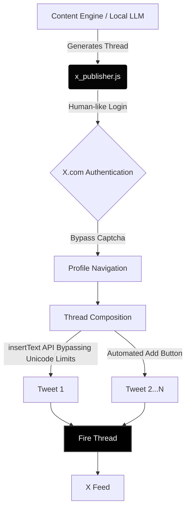

# 🌌 Telos Publisher: Sovereignty Multimodal

A minimalist, high-performance, open-source pipeline to automate multi-threaded X (Twitter) publishing while strictly preserving **Local AI Sovereignty**.

Engineered by [@teloscosmos](https://x.com/teloscosmos) | _"Life is short, stay Telos."_

---

## 🛑 The Problem

Most generic AI browser automation tools (like default Selenium or Puppeteer wrappers) suffer from a critical flaw when interacting with modern web apps like X: **Unicode & Emoji truncation**. 
When typing Chinese characters, complex scripts, or emojis, the browser driver drops internal key-events, resulting in garbled text or missing content.

## 💡 The Telos Solution

This repository contains the `x_publisher.js` core engine. It utilizes `Playwright` and bypasses keyboard driver restrictions by actively injecting the text via `page.keyboard.insertText()` instead of standard typing emulation, guaranteeing **100% data fidelity** for multi-language and multimodal content.

### System Architecture



## 🛠 Usage

1. **Install Dependencies:**
   ```bash
   npm install playwright dotenv
   ```

2. **Configure Credentials:**
   Create a `.env` file in the root directory:
   ```env
   X_USERNAME=your_username
   X_PASSWORD=your_password
   ```

3. **Deploy Thread:**
   Edit the `TWEETS` array in `x_publisher.js` with your content, then run:
   ```bash
   node x_publisher.js
   ```

## 📜 SOP Included

The repository also includes `SOP_MultiModal_Content.md`, our internal 5-step strategic pipeline for producing algorithm-harmonious multimodal posts, from text calibration to physical subtitle rendering.

---
*Code is warmth. Automation is sovereignty.*
